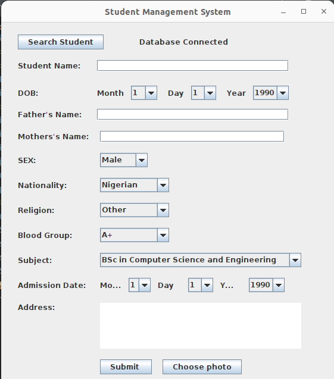

# Student Management System Desktop Application JAVA using Eclipse IDE

Student Management System Desktop Application JAVA using Eclipse IDE.

Student management system is an environment where all the process of the student in the institution is managed. It is done through the automated.

Write a program to build a simple Software for Student Information Management System which can perform the following operations:
Store the First name of the student.
Store the Last name of the student.
Store the unique Roll number for every student.
Store the CGPA of every student so on....

## Screenshots

